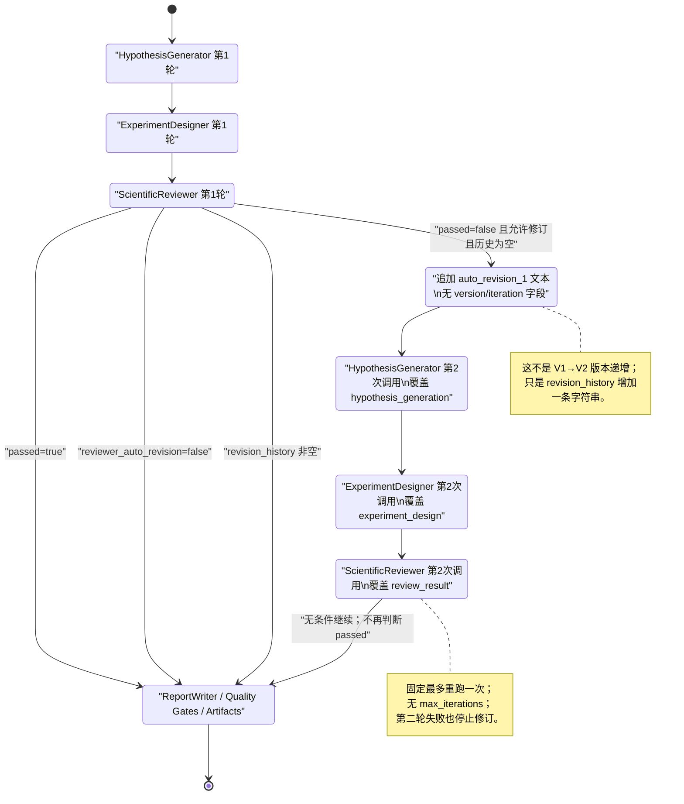
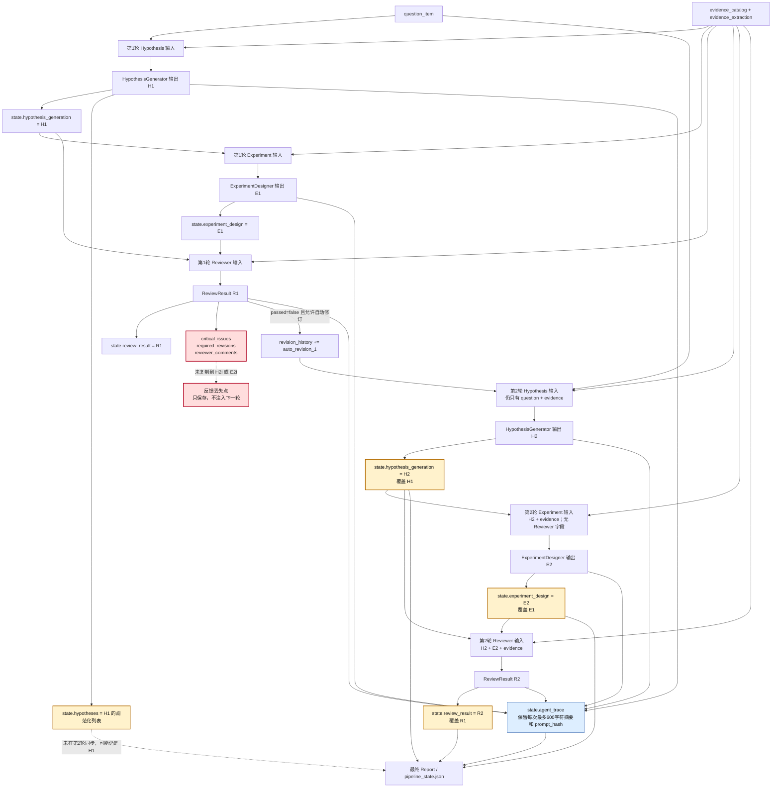
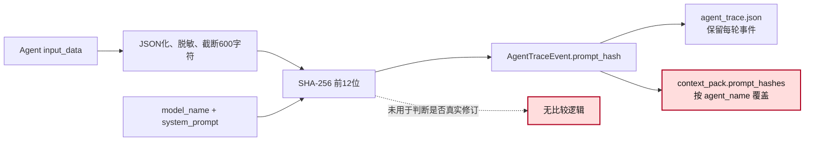

# T02 当前工作流状态与数据流

## 当前状态机

代码依据：

- 首轮假设、实验、Reviewer：`app/workflow/pipeline.py:498-534`
- 自动修订条件与第二次调用：`app/workflow/pipeline.py:535-555`
- 第二轮后直接进入报告：`app/workflow/pipeline.py:557-578`

## 当前数据流

Reviewer 反馈的明确丢失位置是：

1. `state.review_result = review` 保存了 R1
   `app/workflow/pipeline.py:532-534`
2. 修订分支只追加 `revision_history` 文本
   `app/workflow/pipeline.py:535-537`
3. 紧接着构造第二轮 Hypothesis 输入时没有读取 `review` 或
   `state.review_result`
   `app/workflow/pipeline.py:538-546`
4. `_experiment_designer_input()` 也没有 Reviewer 字段
   `app/workflow/pipeline.py:241-260`

## 当前版本、停止与重试逻辑

| 主题 | 当前实现 |
|---|---|
| 版本 | 无 `version` 字段，无 V1/V2；只有 `revision_history` 字符串 |
| iteration | 无显式 `iteration` |
| max iterations | 无 `max_iterations`；代码结构固定最多重跑一次 |
| 重试触发 | `not passed and reviewer_auto_revision and not revision_history` |
| 第二轮停止 | 无条件停止修订并进入 ReportWriter |
| 相同 prompt | 不比较，不阻止记录自动修订 |
| 首轮完整产物 | `hypothesis_generation`、`experiment_design`、`review_result` 被覆盖 |
| trace | 每轮事件仍在 `agent_trace`，但输出只是最多 600 字符摘要 |
| context hash | `context_pack.prompt_hashes` 按 Agent 名折叠，多轮只保留最后一个 |

## 当前 `prompt_hash` 流程

代码依据：

- 输入摘要：`app/agents/base.py:166-182`
- hash：`app/agents/base.py:314-327`
- trace 保存：`app/agents/base.py:329-380,549-563`
- context pack 折叠：`app/workflow/context_builder.py:136-152`

## 当前状态结论

当前实现拥有“Reviewer 失败后再调用一次生成链”的控制流，但没有 Reviewer 驱动的
数据流，也没有可审计的版本递增。因此第二次调用只能称为重跑，不能仅凭
`revision_history` 证明它是一次真实修订。
