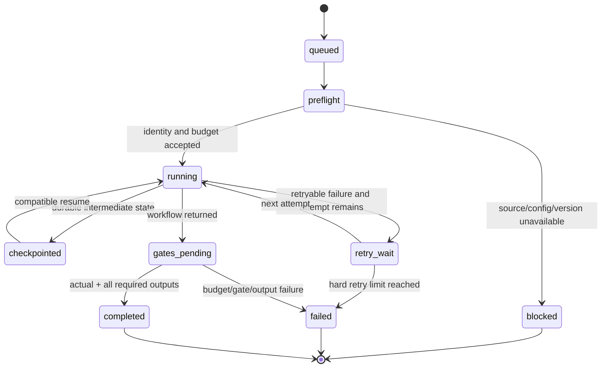

# T07 Batch Contract and Runner RFC

Status: Day 2 implementation contract

Contract version: `t07.batch.v1`

Checkpoint version: `t07.checkpoint.v1`

## 1. Scope

This RFC defines the stable, JSON-serializable boundary for a future
125-question batch run. Day 2 implements the contract, deterministic dry-run,
checkpoint persistence, retry bookkeeping, and resume compatibility checks.
It does not execute the T01-T06 workflow, call a model provider, access an
external API, or claim that the missing authoritative question catalog has
been validated.

The contract deliberately contains plain values only. No workflow state,
provider client, database connection, cache object, or task-internal class may
cross this boundary.

## 2. Contract types

### 2.1 `JobStatus`

| Value | Meaning |
|---|---|
| `queued` | Identity, input hash, and isolation keys are frozen; execution has not started. |
| `preflight` | Source, version, route, and budget checks are running. |
| `running` | The real workflow is executing. Day 2 never enters this state. |
| `checkpointed` | Durable intermediate state is available. |
| `retry_wait` | A retryable attempt failed and another attempt remains. |
| `gates_pending` | Workflow output exists but required files and upstream quality gates are not complete. |
| `blocked` | A prerequisite such as source, configuration, or version is unavailable. |
| `failed` | A non-retryable failure or retry/budget exhaustion ended the job. |
| `completed` | A non-Mock actual result has all standard fields and all required artifacts. |

`result_kind` is independent of status and is one of `planned`, `expected`,
`mock`, or `actual`. A dry-run creates `queued/planned` jobs. Only
`completed/actual` is a deliverable success.

### 2.2 `FailureRecord`

| Field | Type | Semantics |
|---|---|---|
| `error_code` | non-empty string | Stable machine-readable code, for example `QUESTION_SOURCE_NOT_FOUND`. |
| `message` | non-empty string | Human-readable diagnosis without secrets. |
| `retryable` | boolean | Whether the runner may schedule another attempt. |
| `attempt` | integer, `>=1` | Attempt that produced the failure. |
| `occurred_at` | timezone-aware datetime | UTC failure timestamp. |

### 2.3 `ModelRoute`

| Field | Type | Semantics |
|---|---|---|
| `route_id` | non-empty string | Stable routing policy identifier. |
| `provider` | non-empty string | Provider name; Day 2 dry-run uses `none`. |
| `model` | non-empty string | Model name; Day 2 dry-run uses `none`. |
| `model_version` | non-empty string | Frozen model/config version used by resume checks. |
| `prompt_version` | non-empty string | Frozen prompt version used by resume checks. |
| `prompt_hash` | optional SHA-256 | Exact prompt-content binding; dry-run uses `null`, while actual completion requires a value. |

The Day 2 skeleton does not select or modify a production prompt/model
version. Its explicit dry-run route is `dry-run/none/none/unassigned`.
`unassigned` is not valid evidence of a real run.

### 2.4 `BatchBudget`

| Field | Type | Semantics |
|---|---|---|
| `token_limit` | integer, `>=0` | Maximum allowed tokens. |
| `cost_limit_usd` | decimal, `>=0` | Maximum allowed USD cost. |
| `tokens_used` | integer, `>=0` | Accounted tokens. |
| `cost_used_usd` | decimal, `>=0` | Accounted USD cost. |

Usage may not exceed either limit. A dry-run sets all four values to zero.
Future execution must transition to `failed` with
`BUDGET_EXHAUSTED` before making another provider call when either limit is
exhausted.

### 2.5 `RetryPolicy`

| Field | Type | Semantics |
|---|---|---|
| `max_attempts` | integer, `1..10` | Hard total-attempt limit, including the first attempt. |

The runner records every failed attempt. A retryable failure before the limit
enters `retry_wait`; failure at the limit enters `failed`. Recording an
additional attempt is rejected with `RETRY_LIMIT_EXCEEDED`. Neither a caller
nor resume can raise the serialized hard limit implicitly.

### 2.6 `ResumePolicy`

| Field | Type | Semantics |
|---|---|---|
| `enabled` | boolean | Whether checkpoint resume is permitted. |
| `require_source_hash_match` | boolean | Reject checkpoints from a different source snapshot. |
| `require_input_hash_match` | boolean | Reject changed canonical question input. |
| `require_model_route_match` | boolean | Reject changed route, provider, or model identity. |
| `require_model_version_match` | boolean | Reject changed model version. |
| `require_prompt_version_match` | boolean | Reject changed prompt version. |
| `require_prompt_hash_match` | boolean | Reject changed prompt content. |
| `require_schema_version_match` | boolean | Reject changed contract schema. |
| `stale_checkpoint_action` | enum | Day 2 supports only `reject`. |

Resume additionally requires exact `batch_id` and `question_id`. A stale
checkpoint is never silently ignored or treated as completed. The runner
returns stable codes including `RESUME_DISABLED`,
`CHECKPOINT_BATCH_MISMATCH`, `CHECKPOINT_QUESTION_MISMATCH`,
`STALE_CHECKPOINT_INPUT_HASH`, and `STALE_CHECKPOINT_VERSION`.

### 2.7 `OutputContract`

`fields` is a JSON object containing result fields. Its required keys are:

1. `Problem`
2. `Rationale`
3. `Technical Details`
4. `Datasets Source`
5. `Datasets Target`
6. `Title`
7. `Abstract`
8. `Methods`
9. `Experiments`
10. `Results`
11. `References`

`artifacts` maps stable artifact names to non-empty, question-scoped relative
paths. Required keys are:

1. `report.pdf`
2. `report.md`
3. `result.json`
4. `evidence_cards.json`
5. `agent_trace.json`

The required-name lists are serialized with every job so downstream consumers
can evaluate completeness without importing implementation constants. Missing
fields, missing artifacts, empty paths, Mock mode, or a non-`actual`
`result_kind` makes `completed` invalid.

### 2.8 `BatchJob`

| Field | Type | Semantics |
|---|---|---|
| `schema_version` | string | Job contract version, currently `t07.batch.v1`. |
| `batch_id` | non-empty string | Immutable parent batch identity. |
| `question_id` | non-empty string | Exact source record identity. |
| `source_hash` | 64-character lowercase SHA-256 | Exact source-file snapshot binding. |
| `input_hash` | 64-character lowercase SHA-256 | Canonical input binding. |
| `workspace` | non-empty string | Question-scoped relative workspace path. |
| `context_id` | non-empty string | Question-scoped context identity. |
| `cache_namespace` | non-empty string | Question-scoped cache identity. |
| `status` | `JobStatus` | Current serialized state. |
| `result_kind` | enum | `planned`, `expected`, `mock`, or `actual`. |
| `mock` | boolean | Explicit Mock flag. |
| `attempt` | integer, `>=0` | Number of attempts already recorded. |
| `retry_policy` | `RetryPolicy` | Frozen hard retry limit. |
| `budget` | `BatchBudget` | Per-job limit and usage. |
| `model_route` | `ModelRoute` | Frozen provider/model/prompt provenance. |
| `output_contract` | `OutputContract` | Required and currently present outputs. |
| `failures` | list of `FailureRecord` | Ordered failure history. |

`attempt` may not exceed `max_attempts`, and no failure may refer to an attempt
greater than the job attempt count. The three isolation identities must be
non-empty. Their cross-job uniqueness is enforced when building a manifest.

### 2.9 `CheckpointRecord`

| Field | Type | Semantics |
|---|---|---|
| `checkpoint_version` | string | Persistence format, currently `t07.checkpoint.v1`. |
| `batch_id` | string | Must equal the embedded job. |
| `question_id` | string | Must equal the embedded job. |
| `source_hash` | SHA-256 string | Must equal the embedded job and current source snapshot. |
| `input_hash` | SHA-256 string | Must equal the embedded job. |
| `schema_version` | string | Must equal the embedded job. |
| `route_id` / `provider` / `model` | strings | Must equal the embedded model route. |
| `model_version` | string | Must equal the embedded route. |
| `prompt_version` | string | Must equal the embedded route. |
| `prompt_hash` | optional SHA-256 | Must equal the embedded route. |
| `status` | `JobStatus` | Must equal the embedded job. |
| `attempt` | integer | Must equal the embedded job. |
| `job` | `BatchJob` | Complete resumable job snapshot. |
| `updated_at` | timezone-aware datetime | UTC persistence timestamp. |

### 2.10 `BatchManifest`

| Field | Type | Semantics |
|---|---|---|
| `schema_version` | string | Manifest contract version. |
| `batch_id` | non-empty string | Batch identity. |
| `source_kind` | enum | `production` or `synthetic`. |
| `source_path` | non-empty string | Supplied source path, not an assertion of authority. |
| `source_hash` | SHA-256 string | Hash of exact source bytes. |
| `dry_run` | boolean | True for the Day 2 skeleton. |
| `model_route` | `ModelRoute` | Frozen default route. |
| `budget` | `BatchBudget` | Aggregate budget accounting. |
| `retry_policy` | `RetryPolicy` | Default retry policy copied into jobs. |
| `resume_policy` | `ResumePolicy` | Resume compatibility policy. |
| `jobs` | list of `BatchJob` | Full job queue. |
| `total` | integer | Derived from the serialized jobs; inconsistent supplied values are rejected. |
| `status_counts` | object | Derived status-to-count mapping; inconsistent supplied values are rejected. |
| `created_at` | timezone-aware datetime | UTC creation timestamp. |

Duplicate `question_id`, `workspace`, `context_id`, or `cache_namespace` values
are rejected. Every job must bind the manifest `batch_id`, schema version,
model route, and retry policy. JSON round-trip means
`BatchManifest.model_validate_json(manifest.model_dump_json()) == manifest`.

## 3. Input hashing and source classification

`input_hash` is SHA-256 over UTF-8 canonical JSON of the complete question
record with object keys sorted, no insignificant whitespace, and non-ASCII
characters preserved. Any change to the question record therefore invalidates
resume.

`source_hash` is SHA-256 over the exact source-file bytes. Production input is
the intended UTF-8 JSON array. Because that catalog is currently absent,
production loading fails with `QUESTION_SOURCE_NOT_FOUND`.

Synthetic input must be an object with both:

```json
{
  "synthetic": true,
  "questions": [
    {"question_id": "Q001", "question": "Synthetic contract question 001"}
  ]
}
```

The caller must also select `source_kind=synthetic`. A synthetic wrapper passed
as production, or an unmarked fixture passed as synthetic, is rejected. There
is no automatic synthetic fallback.

## 4. State transitions and invariants



Global invariants:

- `dry_run` creates only `queued/planned` jobs and uses zero tokens/cost.
- `mock=true` implies `result_kind=mock` and forbids `completed`.
- `result_kind=actual` requires `mock=false`.
- `completed` requires `result_kind=actual`, every standard field, and every
  required artifact with a non-empty question-scoped path.
- `failed`, `blocked`, and `completed` are terminal for the current skeleton.
- State transitions are persisted before the next externally visible action.
- A failed job does not mutate another job's workspace, context, cache, budget,
  attempt history, or checkpoint.
- The isolated skeleton processor catches one job exception, records
  `JOB_EXECUTION_FAILED`, persists that job, and continues remaining jobs.
  Successful skeleton jobs may reach `checkpointed` but never `actual`.
- A checkpoint cannot change the manifest's retry, budget, route, prompt,
  model, schema, source, or input identity.

## 5. Atomic checkpoint strategy

Each checkpoint is serialized to a uniquely named temporary file in the final
checkpoint directory. The writer flushes Python buffers, calls `fsync`, closes
the file, and then calls `os.replace(temp, final)`. Because the replacement is
within one directory, readers observe either the previous complete checkpoint
or the new complete checkpoint, never a partial JSON document. A failed write
removes only its own temporary file and leaves the previous checkpoint intact.

Manifest persistence uses the same algorithm. The Day 2 dry-run writes one
checkpoint per planned job and then the aggregate manifest. It creates no
research artifacts.

## 6. Resume, stale data, retry, and budget

Resume sequence:

1. Read and Pydantic-validate the checkpoint JSON.
2. Require resume to be enabled.
3. Compare batch and question identity.
4. Compare source snapshot `source_hash` and canonical `input_hash`.
5. Compare route/provider/model identity, model version, prompt version,
   prompt hash, and contract schema.
6. Require checkpoint status/attempt to match the embedded job.
7. Return the validated job snapshot without increasing its retry limit.

Mismatch is a hard rejection. The caller must create a fresh job or explicitly
migrate data; it may not rename the stale file into validity.

On failure, the runner increments `attempt`, appends a `FailureRecord`, and
either enters `retry_wait` or `failed`. When tokens or cost reach a configured
limit, the job enters `failed` with `BUDGET_EXHAUSTED` before another call.
Day 2 has no provider call and therefore cannot consume budget.

## 7. JSON example

This shortened example contains one dry-run job; an accepted Day 2 synthetic
manifest contains exactly 125 jobs.

```json
{
  "schema_version": "t07.batch.v1",
  "batch_id": "day2-synthetic",
  "source_kind": "synthetic",
  "source_path": "tests/batch/fixtures/questions_125.synthetic.json",
  "source_hash": "aaaaaaaaaaaaaaaaaaaaaaaaaaaaaaaaaaaaaaaaaaaaaaaaaaaaaaaaaaaaaaaa",
  "dry_run": true,
  "model_route": {
    "route_id": "dry-run",
    "provider": "none",
    "model": "none",
    "model_version": "unassigned",
    "prompt_version": "unassigned",
    "prompt_hash": null
  },
  "budget": {
    "token_limit": 0,
    "cost_limit_usd": "0",
    "tokens_used": 0,
    "cost_used_usd": "0"
  },
  "retry_policy": {"max_attempts": 3},
  "resume_policy": {
    "enabled": true,
    "require_source_hash_match": true,
    "require_input_hash_match": true,
    "require_model_route_match": true,
    "require_model_version_match": true,
    "require_prompt_version_match": true,
    "require_prompt_hash_match": true,
    "require_schema_version_match": true,
    "stale_checkpoint_action": "reject"
  },
  "jobs": [
    {
      "schema_version": "t07.batch.v1",
      "batch_id": "day2-synthetic",
      "question_id": "Q001",
      "source_hash": "aaaaaaaaaaaaaaaaaaaaaaaaaaaaaaaaaaaaaaaaaaaaaaaaaaaaaaaaaaaaaaaa",
      "input_hash": "bbbbbbbbbbbbbbbbbbbbbbbbbbbbbbbbbbbbbbbbbbbbbbbbbbbbbbbbbbbbbbbb",
      "workspace": "day2-synthetic/Q001/workspace",
      "context_id": "ctx:day2-synthetic:Q001:bbbbbbbbbbbbbbbb",
      "cache_namespace": "cache:day2-synthetic:Q001:bbbbbbbbbbbbbbbb",
      "status": "queued",
      "result_kind": "planned",
      "mock": false,
      "attempt": 0,
      "retry_policy": {"max_attempts": 3},
      "budget": {
        "token_limit": 0,
        "cost_limit_usd": "0",
        "tokens_used": 0,
        "cost_used_usd": "0"
      },
      "model_route": {
        "route_id": "dry-run",
        "provider": "none",
        "model": "none",
        "model_version": "unassigned",
        "prompt_version": "unassigned",
        "prompt_hash": null
      },
      "output_contract": {
        "required_fields": ["Problem", "Rationale", "Technical Details", "Datasets Source", "Datasets Target", "Title", "Abstract", "Methods", "Experiments", "Results", "References"],
        "required_artifacts": ["report.pdf", "report.md", "result.json", "evidence_cards.json", "agent_trace.json"],
        "fields": {},
        "artifacts": {}
      },
      "failures": []
    }
  ],
  "total": 1,
  "status_counts": {"queued": 1},
  "created_at": "2026-07-29T00:00:00Z"
}
```

## 8. Upstream and downstream boundary

T07 consumes T01-T06 only through stable serialized values:

- T01 evidence/gate results and `evidence_cards.json`;
- T02 review/iteration provenance;
- T03 validation and quality-gate outcomes;
- T04 research-plan content;
- T05 execution/result classification, especially planned versus actual;
- T06 export paths, `report.pdf`, `report.md`, `result.json`, and
  `agent_trace.json`.

Day 2 does not import their internal state classes. A later integration owned
by the appropriate tasks must adapt their outputs into `OutputContract`.

T08 can consume `batch_id`, `question_id`, `status`, `result_kind`, `mock`,
failure codes, workspace-relative artifact paths, and version provenance for
API/status presentation. T09 can consume manifest totals, source/input hashes,
attempt/failure history, budgets, route versions, artifact completeness, and
timestamps for CI, evaluation, release checks, and reproducibility evidence.

## 9. Migration, compatibility, and rollback

- Readers reject unknown major schema/checkpoint versions. Additive optional
  fields may be introduced in a minor revision only when old readers can
  ignore them safely.
- Renaming a field, enum value, required output, or hashing rule requires a new
  schema version and an explicit migration that revalidates every record.
- Checkpoints are never upgraded in place. Migration writes a new file,
  validates it, and atomically replaces the target only after success.
- Rollback consists of reverting T07 owner files and deleting only Day 2
  dry-run metadata generated outside tracked source. No production artifact or
  authoritative source is changed by this skeleton.
- A rollback to an older contract may read only matching older checkpoints;
  newer checkpoints remain stale and rejected.

## 10. Known blocker

`data/processed/questions_125.json` is absent. Therefore authoritative count,
question text, duplicate/missing IDs, empty questions, historical
contamination cases, and a formal 125-question run remain not evaluated.
Synthetic evidence validates only contract behavior, count, identity
uniqueness, isolation, checkpoint/retry/resume, and no-call dry-run behavior.
