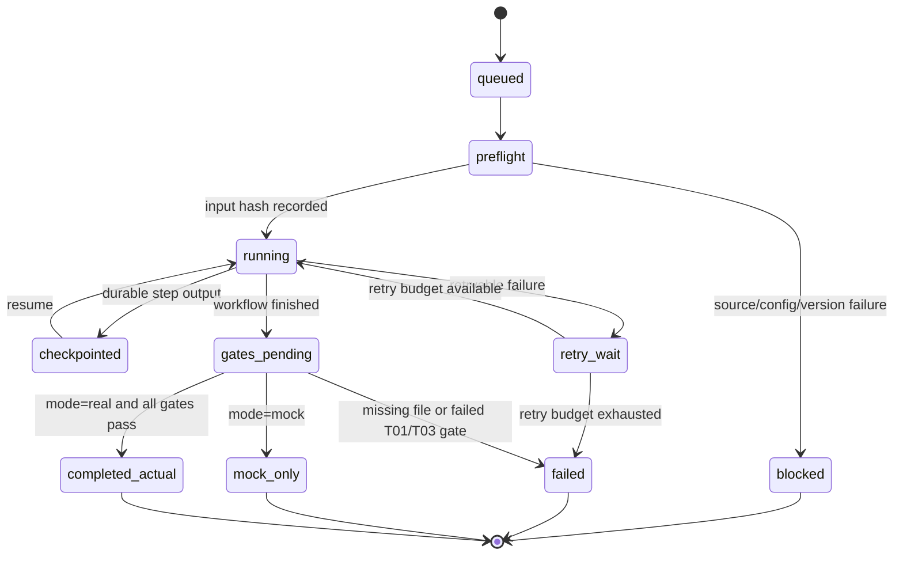

# T07 Day 1 Batch Audit

## 1. Repository baseline

This audit was performed against the local repository at `D:\SAGE125-AI-Scientist`.
All writes are confined to `docs/modules/T07/**`. No runner, production code, test code,
configuration, dependency file, export, cache, or source dataset was modified.

| Item | Fresh observation |
|---|---|
| Branch | `t07/a-batch-contract` |
| HEAD | `1642ea0` |
| HEAD subject | `[GOVERNANCE] Add task-specific content acceptance review (#6)` |
| Expected base ref | `upstream/integration/2026-08-10` |
| Base ref commit | `1642ea0` |
| Root AGENTS.md | not present |
| Pre-authorized existing work | four untracked files under `docs/modules/T07/evidence/` |

The branch and expected baseline match. The pre-existing evidence files had no branch/commit
provenance and were treated as untrusted hints; all material conclusions below were freshly checked.

## 2. Python and test environment

The project environment has been rebuilt with the repository's canonical Python line:

```text
pyproject.toml requires-python: >=3.10,<3.15
GitHub Actions canonical Python: 3.12
Local Python version: 3.12.10
Python executable: D:\SAGE125-AI-Scientist\.venv\Scripts\python.exe
```

The interpreter check exited 0. This audit did not modify `pyproject.toml`, requirements,
GitHub Actions workflows, or PowerShell ExecutionPolicy.

The full suite was run against a temporary `git archive HEAD` checkout of `1642ea0`, using the
project virtual environment by absolute path. This keeps pytest-generated `.pytest_tmp` and cache
files outside the working tree while exercising the exact audited production/test code.

## 3. Exact test results

Pytest command:

```powershell
& "D:\SAGE125-AI-Scientist\.venv\Scripts\python.exe" -m pytest -q
```

Fresh result:

| Metric | Result |
|---|---|
| Python version | `3.12.10` |
| Python executable | `D:\SAGE125-AI-Scientist\.venv\Scripts\python.exe` |
| Command exit code | 0 |
| Collected | 272 (237 passed + 35 skipped) |
| Passed | 237 |
| Failed | 0 |
| Skipped | 35 |
| Warnings | 0 |
| Test duration | 12.55s |
| First failing test | none |
| First failure reason | none |

Skip breakdown:

- 30 tests skipped because `data/processed/questions_125.json` is absent.
- 5 tests skipped because `data/raw/sjtu-booklet.pdf` is absent.

Historical environment incident:

- Status: `BLOCKED_ENVIRONMENT`
- Execution classification: `test suite not executed`
- The previous `.venv` referenced a missing Python 3.13.14 WindowsApps interpreter.
- pytest never started, so the old environment had no valid collected/pass/fail/skip counts.

The earlier unproven `237 passed, 35 skipped in 31.92s` text remains rejected because it had no
command, timestamp, branch, commit, or interpreter provenance. The current result happens to have
the same pass/skip counts, but it is a fresh Python 3.12.10 run with a distinct verified duration
of 12.55s.

`tests/batch/` still does not exist, so no separate batch-directory test command is claimed. Full
command output is in:

- `evidence/day1_baseline.txt`
- `evidence/day1_batch_tests.txt`

## 4. T07 owner scope

Declared owner paths:

- `app/batch/**`
- `scripts/batch_125/**`
- `app/contracts/batch.py`
- `tests/batch/**`
- `docs/modules/T07/**`

Current state:

| Path | State | Day 1 conclusion |
|---|---|---|
| `app/batch/**` | absent | no formal T07 batch implementation |
| `scripts/batch_125/**` | absent | no owner-scoped CLI |
| `app/contracts/batch.py` | absent | no formal batch contract |
| `tests/batch/**` | absent | no owner-scoped tests |
| `docs/modules/T07/**` | present | Day 1 audit only |

The existing batch code is the legacy, out-of-owner-path `scripts/run_batch_125.py`. Day 1 does not
modify it. See `evidence/day1_owner_files.txt`.

## 5. 125-question source

| Required fact | Fresh conclusion |
|---|---|
| Runtime source path | expected `data/processed/questions_125.json`; absent |
| Source format | intended UTF-8 JSON array; absent |
| Extraction input | expected `data/raw/sjtu-booklet.pdf`; absent |
| Companion outputs | intended CSV and extraction report; absent |
| ID format | intended `Q001`...`Q125` |
| Expected count | 125 |
| Actual count | not evaluated |
| Duplicate IDs | not evaluated |
| Missing IDs | not evaluated |
| Empty questions | not evaluated |
| Conflicting real sources | none found |

The intended producer is `scripts/extract_125_questions.py`; the runtime loader is
`app.workflow.pipeline.load_question`; the legacy batch script loads the same default JSON
directly. Unit-test dictionaries and the one-record helper fixture are synthetic and are not
accepted as production sources.

No matching question-source or batch-output object exists in local Git history. See:

- `evidence/day1_question_search.txt`
- `evidence/day1_question_files.txt`
- `evidence/day1_question_audit.txt`

## 6. Current batch entrypoints

### Legacy batch CLI

`scripts/run_batch_125.py:main`:

1. parses Mock/real, subset, resume, dry-run, output, and failure options;
2. requires `data/processed/questions_125.json`;
3. loops over selected question records;
4. calls `app.workflow.pipeline.run_pipeline_with_state`;
5. copies `report.json`, `report.md`, `evidence_cards.json`, and `agent_trace.json` into
   `<output-dir>/<question_id>/`;
6. writes aggregate JSONL, CSV, `batch_manifest.json`, Markdown summary, and best-effort HTML/PDF.

### Single-question workflow

`app.workflow.pipeline.run_pipeline_with_state` wraps the current T01-T06 workflow. The underlying
run creates a unique run_id and new `PipelineState` per invocation, writes a context pack, then
writes artifacts under `exports/{run_id}/`.

### Current test

`tests/test_batch_125_mock.py` specifies a three-question Mock run. It is outside `tests/batch/**`
and is skipped when `questions_125.json` is absent. The fresh full-suite run confirms this test is
currently skipped for that source-data reason.

## 7. Current batch_manifest status

**当前未发现正式 batch_manifest。**

The default expected artifact `exports/batch_125/batch_manifest.json` is absent. The legacy script
contains code to create it only after the entire loop, but code is not a materialized manifest.

Current code-field assessment:

| Capability | Assessment |
|---|---|
| question_id | present in planned row |
| status | present in planned row |
| failure reason | present as `errors` |
| output path | present as `report_path` |
| input hash | missing |
| prompt/model/schema versions | missing |
| checkpoint | missing |
| resume | weak existence-only check |
| retry | missing |
| budget | parsed `--cost-guard` is unused |
| model routing | missing |
| Mock/planned/expected/actual taxonomy | insufficient |
| per-question failure continuation | supported unless fail-fast |
| crash-safe batch recovery | not supported |

Resume currently trusts `<question_id>/report.json` without checking question identity, input hash,
mode, versions, required files, or gates. The runner also marks a row completed after best-effort
copying, even when required files are absent. See `evidence/day1_manifest_audit.txt`.

## 8. Current workspace, context, cache, and output state

### Workspace/output isolation present today

- Each workflow call creates a new run_id and new `PipelineState`.
- Each run writes to `exports/{run_id}/`.
- The legacy batch copy target is `<output-dir>/<question_id>/`.
- Exceptions are captured per question and the loop normally continues.

### Isolation gaps

- No formal batch_id or durable per-question job state exists.
- No input hash binds a source record to outputs.
- No prompt/model/schema version binds resume decisions.
- No per-question cache namespace contract exists.
- The batch runner ignores the per-run artifact manifest and does not require PDF.
- Aggregate rows are persisted only after the loop; process crashes lose the in-memory batch state.
- Reusing an output directory can accept stale report files.
- Fixed Mock evidence IDs are reused across questions.

No batch result-cache implementation was found, so a cache-key collision is not claimed as a current
incident. The absence of a cache contract remains a design gap.

## 9. Confirmed contamination cases

Confirmed reproducible case count: **0**.

The repository has no authoritative question catalog and no per-question/batch reports to compare.
The only local exports are doctor and provider-smoke reports. Local Git history contains no missing
question source or batch output. Fabricated cases were not created.

Static risks, kept separate from confirmed cases:

1. global `EV-MOCK-0001..0003` evidence IDs can collide if a future cache/dedup is global;
2. Mock topic matching uses substring `"ai"`, which can match unrelated words;
3. resume can accept stale or mismatched `report.json`.

Preventive tests exist for prime-versus-pandemic output, different titles, and stale UI state, but
the question-dependent tests cannot currently execute. See:

- `evidence/day1_mock_search.txt`
- `evidence/day1_contamination_audit.txt`

## 10. Search blocker for missing cases

The team lead must provide at least one authoritative artifact set before three real failures can be
fixed:

- `data/processed/questions_125.json` plus a licensed/source-verifiable booklet;
- a commit containing the authoritative catalog;
- historical `exports/batch_125/**`; or
- failed per-question outputs with commit, command, and environment metadata.

Until then, all pairwise title/abstract/hypothesis comparisons and question-bound reproduction
commands are blocked.

## 11. Current architecture

```mermaid
flowchart LR
    QS["Expected questions source<br/>data/processed/questions_125.json<br/>(currently missing)"]
    CLI["Legacy CLI<br/>scripts/run_batch_125.py"]
    LOOP["In-memory question loop"]
    PIPE["T01-T06 workflow<br/>run_pipeline_with_state"]
    STATE["New run_id + PipelineState"]
    RUNOUT["exports/run_id/<br/>single-run artifacts"]
    COPY["exports/batch_125/question_id/<br/>best-effort copy of 4 files"]
    AGG["JSONL / CSV / batch_manifest / summary<br/>written after loop"]

    QS -->|"missing: execution stops"| CLI
    CLI -. "code path if source exists" .-> LOOP
    LOOP --> PIPE
    PIPE --> STATE
    STATE --> RUNOUT
    RUNOUT --> COPY
    COPY --> AGG
```



The diagram describes current code plus the materialized source blocker. It does not imply that a
batch run or manifest currently exists.

## 12. Target architecture

```mermaid
flowchart LR
    QS["125 Question Source"]
    BM["Batch Manifest<br/>source + input hashes + frozen versions"]
    JOB["Per-question Job"]
    WS["Isolated Workspace"]
    NS["Independent Context / Memory / Cache Namespace"]
    WF["T01-T06 Workflow"]
    G1["T01 Evidence Gate"]
    G3["T03 Validation Gate"]
    OUT["PDF / MD / JSON / evidence_cards.json / agent_trace.json"]
    CP["Checkpoint / Resume / Retry"]
    IDX["Final Index + checksums + summary"]

    QS --> BM
    BM --> JOB
    JOB --> WS
    WS --> NS
    NS --> WF
    WF --> G1
    G1 --> G3
    G3 --> OUT
    JOB <--> CP
    OUT --> CP
    CP --> IDX
```



Target invariants:

- one immutable input snapshot per question;
- output/cache/context keys include batch_id, question_id, and input hash;
- only real mode plus complete required files and passed gates can become actual/completed;
- Mock, planned, expected, and actual are distinct;
- checkpoints are persisted atomically after every state transition;
- one job failure never invalidates or reruns completed jobs.

## 13. Per-question workspace directory draft

```text
runs/
└── <batch_id>/
    ├── manifest.json
    ├── index.json
    ├── checksums.sha256
    ├── Q001/
    │   ├── input.json
    │   ├── state.json
    │   ├── workspace/
    │   ├── context/
    │   ├── cache/
    │   ├── report.pdf
    │   ├── report.md
    │   ├── result.json
    │   ├── evidence_cards.json
    │   ├── agent_trace.json
    │   ├── quality_gates.json
    │   └── artifacts_manifest.json
    ├── Q002/
    └── ...
```

The directory is a Day 1 target design only; it was not created.

## 14. Job state draft



State and result class must be separate fields:

- state: queued/preflight/running/checkpointed/retry_wait/blocked/failed/gates_pending/terminal
- result_kind: planned/expected/mock/actual

`completed_actual` is the only deliverable-success terminal state.

## 15. Output contract draft

Required per-job identity:

| Field | Requirement |
|---|---|
| batch_id | immutable batch identifier |
| question_id | exact source ID |
| input_hash | SHA-256 of canonical input record |
| source_hash | SHA-256 of catalog/source snapshot |
| prompt_version | frozen explicit value |
| model_route/model_version | frozen explicit values |
| schema_version | frozen explicit value |
| mode | dry_run/mock/real |
| result_kind | planned/expected/mock/actual |
| state | serialized job state |
| attempts | retry history with timestamps/reasons |
| output_paths | relative, question-scoped paths |
| gate_results | T01/T03 and completeness results |

Required actual output files:

- `report.pdf`
- `report.md`
- `result.json`
- `evidence_cards.json`
- `agent_trace.json`
- `quality_gates.json`
- `artifacts_manifest.json`

Any missing required file, question/input mismatch, Mock mode, or failed gate prevents
`completed_actual`.

## 16. Risks and gaps

| Priority | Gap | Evidence | Consequence |
|---|---|---|---|
| P0 | question source and booklet absent | data inventory | no 125 statistics/dry-run/cases |
| P1 | no formal T07 contract/owner implementation | owner path inventory | no enforceable interface |
| P1 | no materialized batch manifest | exports/tree search | no resumable audit trail |
| P1 | resume is existence-only | run_batch lines 130-137 | stale/mismatched outputs accepted |
| P1 | required files can be missing while row completes | lines 140-145 | false completion |
| P1 | no incremental checkpoint/retry | rows written after loop | crash loses batch state |
| P1 | no input/version hashes | manifest field audit | invalid reuse and poor provenance |
| P1 | Mock can have row status completed | batch row/global mock design | ambiguous delivery status |
| P2 | fixed Mock evidence IDs | mock_outputs lines 27-28 | future cross-job collision risk |
| P2 | substring `"ai"` topic match | mock_outputs line 267 | possible wrong Mock content pack |

## 17. Day 2 plan

No Day 2 implementation was performed. Recommended sequence:

1. Team lead supplies or authorizes the canonical booklet/question catalog; validate 125 count,
   exact IDs, duplicates, missing records, empty text, and domain mapping.
2. Add red tests under `tests/batch/**` for contract validation, source hashing, missing-file
   failure, Mock/actual separation, atomic checkpoint, retry, resume mismatch, and isolated paths.
3. Define `app/contracts/batch.py` with manifest/job/output schemas and explicit version fields.
4. Add the smallest runner skeleton under `app/batch/**` and CLI under `scripts/batch_125/**`.
5. Run a no-model dry-run over all 125 IDs; do not start a formal 125-question model run.
6. Re-run contamination comparisons on real/historical outputs and fix at most three evidence-backed
   cases.

Steps 2-6 must remain inside T07 owner paths or be raised to the owning task as blockers.

## 18. Evidence index

- `evidence/day1_baseline.txt`
- `evidence/day1_batch_tests.txt`
- `evidence/day1_owner_files.txt`
- `evidence/day1_question_search.txt`
- `evidence/day1_question_files.txt`
- `evidence/day1_question_audit.txt`
- `evidence/day1_manifest_audit.txt`
- `evidence/day1_mock_search.txt`
- `evidence/day1_contamination_audit.txt`
